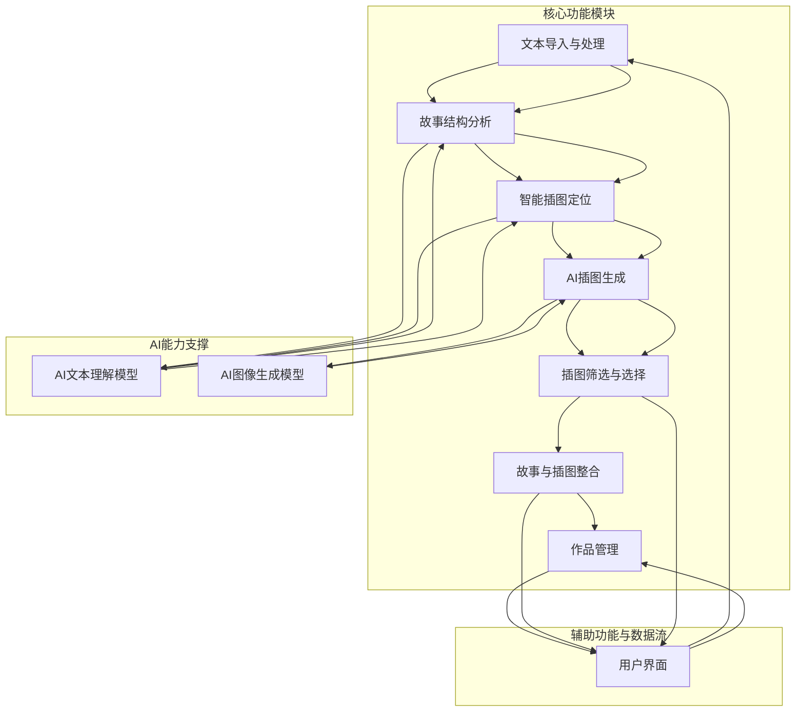
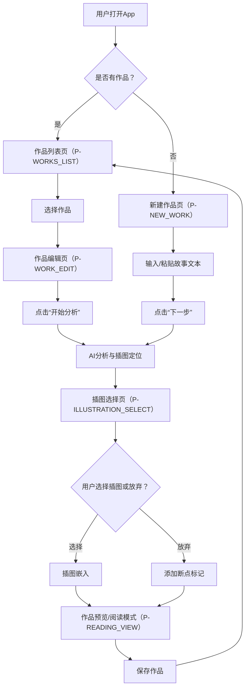
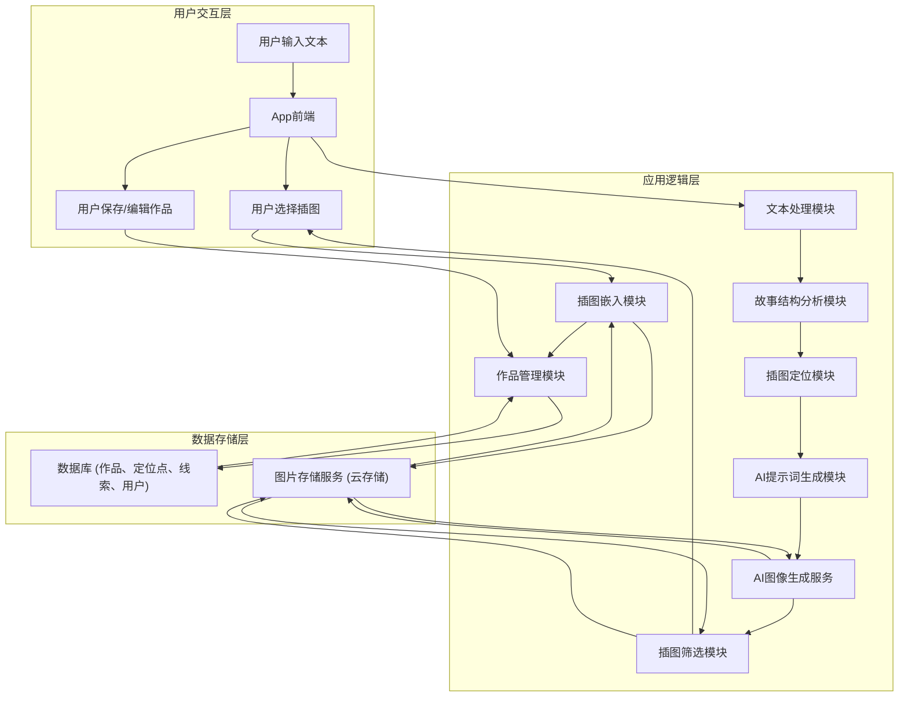

# Welcome to your Expo app 👋

This is an [Expo](https://expo.dev) project created with [`create-expo-app`](https://www.npmjs.com/package/create-expo-app).

## Get started

1. Install dependencies

   ```bash
   npm install
   ```

2. Start the app

   ```bash
    npx expo start
   ```

In the output, you'll find options to open the app in a

- [development build](https://docs.expo.dev/develop/development-builds/introduction/)
- [Android emulator](https://docs.expo.dev/workflow/android-studio-emulator/)
- [iOS simulator](https://docs.expo.dev/workflow/ios-simulator/)
- [Expo Go](https://expo.dev/go), a limited sandbox for trying out app development with Expo

You can start developing by editing the files inside the **app** directory. This project uses [file-based routing](https://docs.expo.dev/router/introduction).

## Get a fresh project

When you're ready, run:

```bash
npm run reset-project
```

This command will move the starter code to the **app-example** directory and create a blank **app** directory where you can start developing.

## Learn more

To learn more about developing your project with Expo, look at the following resources:

- [Expo documentation](https://docs.expo.dev/): Learn fundamentals, or go into advanced topics with our [guides](https://docs.expo.dev/guides).
- [Learn Expo tutorial](https://docs.expo.dev/tutorial/introduction/): Follow a step-by-step tutorial where you'll create a project that runs on Android, iOS, and the web.

## Join the community

Join our community of developers creating universal apps.

- [Expo on GitHub](https://github.com/expo/expo): View our open source platform and contribute.
- [Discord community](https://chat.expo.dev): Chat with Expo users and ask questions.

# 画叙产品需求文档

## 1. 产品概述

### 1.1 产品名称与定位

*   **产品名称:** 画叙
*   **产品定位:** 一款基于AI技术，能够智能识别故事文本中的关键情节、高潮、结局及画面感强的句子，并自动生成、筛选和嵌入高质量插图的移动端应用。旨在提升故事阅读体验，将文字转化为生动的视觉叙事。
*   **产品应用语言:** 简体中文

### 1.2 产品愿景与目标

*   **产品愿景:** 成为用户创作和阅读图文并茂故事的首选工具，让文字插上想象的翅膀，通过智能视觉化提升故事的吸引力和传播力。
*   **产品目标:**
    *   提供流畅的文本导入和处理体验。
    *   实现精准的故事结构分析和插图智能定位。
    *   生成高质量、风格一致的AI插图。
    *   提供便捷的插图筛选和用户选择机制。
    *   支持完整的作品管理功能，包括保存、编辑和阅读。

### 1.3 产品使用终端

*   **终端类型:** 移动端App (iOS & Android) 与 Windows 桌面端

### 1.4 核心价值主张

*   **智能视觉化:** 利用AI技术自动将故事文本转化为图文并茂的视觉叙事，极大提升阅读沉浸感。
*   **创作辅助:** 为故事创作者提供高效的插图生成工具，节省寻找或绘制插图的时间和精力。
*   **个性化定制:** 用户可参与插图选择过程，确保最终呈现符合个人审美和故事意图。
*   **结构解析:** 深入理解故事脉络，在关键节点精准插入插图，增强故事表现力。

### 1.5 目标用户群体分析

*   **故事创作者:** 小说作者、自媒体内容创作者、学生等，希望通过图文结合的方式丰富作品表现形式，吸引更多读者。
*   **阅读爱好者:** 喜欢阅读故事，并期待更具视觉冲击力和沉浸感阅读体验的用户。
*   **教育工作者/家长:** 希望将文字故事转化为更生动有趣的图文形式，用于教学或亲子阅读。

### 1.6 市场需求与竞品简析

*   **市场需求:**
    *   随着AI技术的发展，内容创作和消费方式正在发生变革，用户对个性化、智能化内容生成工具的需求日益增长。
    *   图文结合的内容形式在社交媒体、在线阅读平台等场景下更受欢迎，能有效提升内容的传播效率和用户粘性。
    *   传统插图制作成本高、周期长，AI生成技术为快速、低成本地获取高质量插图提供了新途径。
*   **竞品简析:**
    *   **通用AI绘画工具 (如Midjourney, DALL-E, 文心一格):** 提供强大的图像生成能力，但缺乏对故事文本的深度理解和智能插图定位功能，用户需手动输入提示词并自行判断插图位置。
    *   **在线图文排版工具 (如Canva, 美图秀秀):** 提供图文排版功能，但不具备AI插图生成能力，用户需自行寻找或上传图片。
    *   **部分阅读App:** 可能提供少量图文混排内容，但通常是人工制作，非AI智能生成，且无法由用户自定义。
*   **画叙优势:** 专注于故事文本的智能理解和插图生成，提供端到端的解决方案，将AI绘画与故事内容深度融合，形成独特的产品竞争力。

## 2. 功能规格

### 2.1 功能详述

#### 2.1.1 文本导入与处理

| 功能ID | 功能名称 | 功能描述 | 优先级 |
|--------|---------|---------|--------|
| F-TEXT_001 | 文本输入 | 用户可以通过手动输入或粘贴的方式将故事文本导入应用。支持常见的文本格式（如TXT、纯文本）。 | P0 |
| F-TEXT_002 | 文本分段 | 系统自动识别故事文本中的段落结构（如换行符、标点符号），将文本分割成多个段落，为后续插图定位和嵌入做准备。 | P0 |
| F-TEXT_003 | 文本保存 | 用户输入的故事文本在编辑过程中自动保存，防止数据丢失。支持用户手动保存当前编辑状态。 | P0 |

#### 2.1.2 故事结构分析

| 功能ID | 功能名称 | 功能描述 | 优先级 |
|--------|---------|---------|--------|
| F-ANALYZE_001 | 线索识别 | 系统自动识别故事中的主要情节线索（明线）和潜在的次要线索（暗线），并进行标记。 | P0 |
| F-ANALYZE_002 | 多故事检测 | 识别同一文本中是否包含多个独立的故事单元（如系列故事、短篇集），并进行区分。 | P1 |
| F-ANALYZE_003 | 叙事结构分析 | 识别故事中的叙事方式，如倒叙、插叙、顺叙等时间跳转，并进行标记。 | P1 |
| F-ANALYZE_004 | 脉络分块 | 将故事文本按照不同的线索、时间线或主题进行结构化分块，便于后续插图的精准定位和风格一致性管理。 | P0 |

#### 2.1.3 智能插图定位

| 功能ID | 功能名称 | 功能描述 | 优先级 |
|--------|---------|---------|--------|
| F-LOCATION_001 | 高潮识别 | 系统自动识别故事中的冲突最激烈、情感最集中的高潮部分，并标记为插图生成的优先位置。 | P0 |
| F-LOCATION_002 | 结局识别 | 系统自动识别故事的结尾部分（无论是悲剧、喜剧还是开放式结局），并标记为插图生成的重要位置。 | P0 |
| F-LOCATION_003 | 前奏识别 | 系统自动识别故事的开端引入部分，包括背景介绍、人物出场等，尝试在合理位置生成插图。 | P1 |
| F-LOCATION_004 | 画面感识别 | 系统自动识别故事中描述性强、画面感丰富的句子或段落，并标记为插图生成的候选位置。 | P0 |
| F-LOCATION_005 | 线索关键节点 | 识别各故事线索中的关键转折点、重要事件或人物关系变化，并标记为插图生成的候选位置。 | P1 |

#### 2.1.4 AI插图生成

| 功能ID | 功能名称 | 功能描述 | 优先级 |
|--------|---------|---------|--------|
| F-GENERATE_001 | 上下文分析 | 针对每个插图定位点，系统深入分析其前后文提供的人物、场景、情节、情感等线索和信息。 | P0 |
| F-GENERATE_002 | 提示词生成 | 基于上下文分析结果，自动生成优化的绘图提示词（Prompt），确保生成的插图与故事内容高度匹配。 | P0 |
| F-GENERATE_003 | 多图生成 | 为每个插图定位点生成多张（例如3-5张）风格或细节略有差异的候选插图，供用户选择。 | P0 |
| F-GENERATE_004 | 风格一致性 | 系统尝试保持同一故事线索或整个故事的插图风格一致性，确保视觉体验的连贯性。 | P1 |

#### 2.1.5 插图筛选与选择

| 功能ID | 功能名称 | 功能描述 | 优先级 |
|--------|---------|---------|--------|
| F-SELECT_001 | 质量筛选 | 系统自动对生成的候选插图进行初步质量筛选，剔除明显不符合要求（如模糊、内容不相关）的图片。 | P0 |
| F-SELECT_002 | 用户选择 | 展示经过初步筛选的候选插图，供用户预览并选择最佳版本。 | P0 |
| F-SELECT_003 | 放弃选项 | 允许用户放弃当前位置的插图生成，并选择不插入任何图片。 | P0 |
| F-SELECT_004 | 多图滚动选择 | 当存在多张合适图片时，提供左右滚动选择功能，并在选择界面展示上下文联系信息。 | P0 |

#### 2.1.6 故事与插图整合

| 功能ID | 功能名称 | 功能描述 | 优先级 |
|--------|---------|---------|--------|
| F-INTEGRATE_001 | 插图嵌入 | 将用户选定的插图自动嵌入到故事文本的相应位置，形成图文混排的完整故事。 | P0 |
| F-INTEGRATE_002 | 断点标记 | 对用户选择放弃生成插图的位置，系统自动添加一个不可见的断点标记，方便后续回溯或重新生成。 | P1 |
| F-INTEGRATE_003 | 阅读模式 | 提供一个沉浸式的图文混排故事阅读视图，支持文本和图片的流畅切换与展示。 | P0 |
| F-INTEGRATE_004 | 线索导航 | 在阅读模式下，支持用户按不同故事线索（如明线、暗线）查看相应的图文内容，方便用户理解复杂故事结构。 | P1 |

#### 2.1.7 作品管理

| 功能ID | 功能名称 | 功能描述 | 优先级 |
|--------|---------|---------|--------|
| F-MANAGE_001 | 作品保存 | 保存包含插图的完整故事作品，支持作品名称、作者等元数据的编辑。 | P0 |
| F-MANAGE_002 | 作品列表 | 展示用户创建的所有已保存故事作品，支持按时间、名称等排序。 | P0 |
| F-MANAGE_003 | 作品编辑 | 允许用户重新编辑已保存故事的文本内容和已嵌入的插图（包括重新生成、替换或删除）。 | P0 |

### 2.2 功能模块间的关系图



## 3. 用户流程

### 3.1 用户旅程地图

| 阶段 | 用户目标 | 用户行为 | 系统响应 | 痛点/机遇 |
|------|----------|----------|----------|-----------|
| **启动与导入** | 开始创作/阅读 | 打开App，选择“新建作品”或“导入文本” | 显示作品列表或文本输入界面 | 文本导入不便/格式不兼容 |
| **文本输入** | 提供故事内容 | 手动输入或粘贴故事文本 | 实时显示文本，自动分段 | 输入效率低/文本丢失 |
| **智能分析** | 理解故事结构 | 点击“开始分析”或系统自动触发 | 后台进行故事结构分析，识别插图定位点 | 分析不准确/耗时过长 |
| **插图生成** | 获取候选插图 | 系统自动或用户触发插图生成 | 显示生成进度，生成多张候选图 | 生成质量低/风格不符 |
| **插图选择** | 优化插图效果 | 浏览候选图，选择最佳或放弃 | 实时更新选定结果，提供放弃选项 | 选择困难/无满意图 |
| **作品整合** | 形成完整作品 | 系统自动嵌入插图 | 显示图文混排预览 | 排版混乱/插图错位 |
| **作品管理** | 保存与回顾 | 保存作品，查看作品列表，再次编辑 | 作品成功保存，列表更新，可进入编辑模式 | 作品丢失/查找困难 |
| **阅读体验** | 享受图文故事 | 进入阅读模式，浏览故事 | 流畅展示图文内容，支持线索导航 | 阅读体验不佳/导航不便 |

### 3.2 关键路径流程图



### 3.3 各场景下的用户操作步骤

#### 3.3.1 新建作品并生成插图

1.  **用户操作:** 打开画叙App。
2.  **系统响应:** 显示作品列表页（P-WORKS_LIST）。
3.  **用户操作:** 点击“新建作品”按钮。
4.  **系统响应:** 跳转至新建作品页（P-NEW_WORK）。
5.  **用户操作:** 在文本输入框中输入或粘贴故事文本。
6.  **系统响应:** 实时显示文本内容，系统自动进行文本分段。
7.  **用户操作:** 点击“下一步”或“开始分析”按钮。
8.  **系统响应:** 系统后台进行故事结构分析（F-ANALYZE_001至F-ANALYZE_004）和智能插图定位（F-LOCATION_001至F-LOCATION_005），并显示加载进度。
9.  **系统响应:** 分析完成后，跳转至插图选择页（P-ILLUSTRATION_SELECT），显示第一个插图定位点的多张候选插图。
10. **用户操作:** 浏览候选插图，选择一张最佳插图，或点击“放弃”按钮。
11. **系统响应:** 如果选择插图，系统将其嵌入到故事中（F-INTEGRATE_001）；如果放弃，系统添加断点标记（F-INTEGRATE_002）。然后自动跳转至下一个插图定位点，重复步骤9-11，直到所有定位点处理完毕。
12. **系统响应:** 所有插图处理完毕后，自动跳转至作品预览/阅读模式（P-READING_VIEW），展示完整的图文混排故事。
13. **用户操作:** 点击“保存”按钮。
14. **系统响应:** 弹出保存作品对话框，用户输入作品名称和作者信息，点击“确认保存”。
15. **系统响应:** 作品保存成功（F-MANAGE_001），并返回作品列表页（P-WORKS_LIST），新作品显示在列表中。

#### 3.3.2 编辑现有作品

1.  **用户操作:** 打开画叙App。
2.  **系统响应:** 显示作品列表页（P-WORKS_LIST）。
3.  **用户操作:** 在作品列表中选择一个已保存的作品，点击进入。
4.  **系统响应:** 跳转至作品编辑页（P-WORK_EDIT），显示故事文本和已嵌入的插图。
5.  **用户操作:** 对故事文本进行修改（如增删改），或点击已嵌入的插图进行编辑（如重新生成、替换、删除）。
6.  **系统响应:** 如果修改文本，系统自动保存（F-TEXT_003）。如果点击插图，弹出插图编辑选项，用户选择“重新生成”或“替换”。
7.  **用户操作:** 如果选择“重新生成”，系统将重新进行AI插图生成（F-GENERATE_001至F-GENERATE_004），并跳转至插图选择页（P-ILLUSTRATION_SELECT）供用户选择新图。
8.  **系统响应:** 用户选择新图后，系统更新嵌入的插图。
9.  **用户操作:** 点击“保存”按钮。
10. **系统响应:** 作品更新保存成功（F-MANAGE_001），并返回作品列表页（P-WORKS_LIST）。

#### 3.3.3 阅读作品

1.  **用户操作:** 打开画叙App。
2.  **系统响应:** 显示作品列表页（P-WORKS_LIST）。
3.  **用户操作:** 在作品列表中选择一个已保存的作品，点击“阅读”按钮或直接点击作品卡片。
4.  **系统响应:** 跳转至作品预览/阅读模式（P-READING_VIEW），以沉浸式图文混排方式展示故事内容。
5.  **用户操作:** 滑动屏幕阅读故事。
6.  **系统响应:** 页面平滑滚动，图片和文本交替显示。
7.  **用户操作:** （可选）点击“线索导航”按钮。
8.  **系统响应:** 弹出线索列表，用户选择特定线索后，页面自动跳转到该线索的起始位置，并高亮显示该线索相关内容（F-INTEGRATE_004）。

## 4. 数据流设计

### 4.1 数据结构与关系

*   **用户 (User):**
    *   `user_id` (PK)
    *   `username`
    *   `email`
    *   `password_hash`
    *   `created_at`
    *   `updated_at`
*   **作品 (Work):**
    *   `work_id` (PK)
    *   `user_id` (FK to User)
    *   `title`
    *   `author`
    *   `original_text` (原始故事文本)
    *   `processed_text` (分段后的文本，包含插图嵌入标记)
    *   `status` (草稿/已完成)
    *   `created_at`
    *   `updated_at`
*   **插图 (Illustration):**
    *   `illustration_id` (PK)
    *   `work_id` (FK to Work)
    *   `position_in_text` (在文本中的嵌入位置索引)
    *   `image_url` (存储图片的URL)
    *   `prompt_used` (生成该图所用的提示词)
    *   `is_selected` (是否被用户选中)
    *   `style_tag` (风格标签，用于风格一致性)
    *   `created_at`
*   **插图定位点 (IllustrationLocation):**
    *   `location_id` (PK)
    *   `work_id` (FK to Work)
    *   `start_index` (文本起始索引)
    *   `end_index` (文本结束索引)
    *   `type` (高潮/结局/画面感/线索节点等)
    *   `status` (待生成/已生成/已选择/已放弃)
    *   `created_at`
    *   `updated_at`
*   **故事线索 (StoryThread):**
    *   `thread_id` (PK)
    *   `work_id` (FK to Work)
    *   `thread_name` (线索名称，如“主线”、“暗线1”)
    *   `description`
    *   `start_index`
    *   `end_index`
    *   `created_at`

### 4.2 关键数据流向图



### 4.3 数据存储与处理原则

1.  **数据安全:**
    *   用户敏感信息（如密码）进行加密存储。
    *   所有数据传输采用HTTPS加密协议。
    *   定期进行数据备份，确保数据可恢复性。
2.  **数据一致性:**
    *   采用事务管理，确保作品、插图、定位点等数据之间的关联性和一致性。
    *   插图嵌入标记与实际图片URL保持同步更新。
3.  **数据可扩展性:**
    *   数据库设计考虑未来功能扩展，如增加更多元数据、支持更多文件格式等。
    *   图片存储采用云存储服务，具备高可用性和弹性伸缩能力。
4.  **数据处理效率:**
    *   文本分析和AI生成过程采用异步处理，避免阻塞用户界面。
    *   对常用数据进行缓存，提高读取效率。
    *   优化数据库查询，确保作品列表、阅读等操作的流畅性。
5.  **数据隐私:**
    *   严格遵守用户数据隐私保护法规，未经用户授权，不得共享或滥用用户数据。
    *   AI模型训练数据与用户创作数据严格隔离。

## 5. 页面规格

### 5.1 页面概览

| 页面ID | 页面名称 | 核心功能 |
|--------|---------|---------|
| P-WORKS_LIST | 作品列表页 | 展示用户所有作品，提供新建、编辑、阅读入口 |
| P-NEW_WORK | 新建作品页 | 接收用户输入的故事文本 |
| P-WORK_EDIT | 作品编辑页 | 编辑故事文本和已嵌入的插图 |
| P-ILLUSTRATION_SELECT | 插图选择页 | 展示候选插图，供用户选择或放弃 |
| P-READING_VIEW | 作品预览/阅读模式 | 沉浸式图文混排阅读体验 |
| P-SETTINGS | 设置页 | 应用通用设置，如账户管理、通知等 |
| P-ABOUT_US | 关于我们页 | 应用版本信息、隐私政策、用户协议等 |
| P-ACCOUNT_SETTINGS | 账户设置页 | 用户个人信息修改、密码修改等 |
| P-NOTIFICATION_SETTINGS | 通知设置页 | 应用通知开关设置 |

### 5.2 页面详情

#### 5.2.1 作品列表页（P-WORKS_LIST）

*   **页面名称与目的:** 作品列表页，展示用户创建的所有故事作品，并提供新建、编辑、阅读作品的入口。
*   **页面负责的核心功能:** 作品管理（F-MANAGE_002）。
*   **主要UI元素与布局建议:**
    *   顶部导航栏：左侧“设置”图标，右侧“新建作品”按钮。
    *   作品列表区域：以卡片或列表形式展示作品，每张卡片包含作品名称、作者、创建日期、封面图（可选）。
    *   每张作品卡片底部或右侧：包含“阅读”、“编辑”按钮。
    *   空状态提示：当无作品时，显示引导用户新建作品的提示。
*   **页面需展示的关键数据:**
    *   作品列表：`work_id`, `title`, `author`, `created_at`。

#### 5.2.2 新建作品页（P-NEW_WORK）

*   **页面名称与目的:** 新建作品页，用于接收用户输入的故事文本，作为AI插图生成的基础。
*   **页面负责的核心功能:** 文本输入（F-TEXT_001）、文本分段（F-TEXT_002）、文本保存（F-TEXT_003）。
*   **主要UI元素与布局建议:**
    *   顶部导航栏：左侧“返回”按钮，右侧“下一步”或“开始分析”按钮。
    *   文本输入区域：一个可滚动的多行文本框，支持文本输入和粘贴。
    *   底部提示：提示用户输入的文本长度或格式要求。
*   **页面需展示的关键数据:**
    *   用户输入的故事文本。

#### 5.2.3 作品编辑页（P-WORK_EDIT）

*   **页面名称与目的:** 作品编辑页，允许用户对已保存的故事文本和已嵌入的插图进行修改和调整。
*   **页面负责的核心功能:** 文本输入（F-TEXT_001）、文本分段（F-TEXT_002）、文本保存（F-TEXT_003）、作品编辑（F-MANAGE_003）。
*   **主要UI元素与布局建议:**
    *   顶部导航栏：左侧“返回”按钮，右侧“保存”按钮。
    *   文本编辑区域：一个可滚动的多行文本框，显示当前作品的文本内容，已嵌入的插图以占位符或缩略图形式显示。
    *   插图编辑选项：点击插图占位符或缩略图时，弹出“重新生成”、“替换”、“删除”等选项。
*   **页面需展示的关键数据:**
    *   作品的`title`, `author`, `processed_text` (包含插图嵌入标记)。
    *   已嵌入插图的`image_url`。

#### 5.2.4 插图选择页（P-ILLUSTRATION_SELECT）

*   **页面名称与目的:** 插图选择页，展示AI为特定文本段落生成的多张候选插图，供用户选择最佳版本或放弃生成。
*   **页面负责的核心功能:** 插图筛选与选择（F-SELECT_001, F-SELECT_002, F-SELECT_003）。
*   **主要UI元素与布局建议:**
    *   顶部导航栏：左侧“返回”按钮，右侧“跳过”或“完成”按钮。
    *   断点提示：在文本中需要生成插图的位置显示明显的断点标记，提示用户此处正在处理插图生成。
    *   当前文本段落预览：显示当前正在生成插图的文本段落，帮助用户理解上下文。
    *   上下文联系展示区：当有多张候选图片时，显示与当前插图位置相关的上下文联系信息，辅助用户选择。
    *   候选插图展示区：以横向滚动形式展示多张候选插图，支持左右滑动切换。
    *   选择按钮：每张插图下方或上方有“选择”按钮，选中后自动嵌入到文本断点处。
    *   “放弃”按钮：位于候选插图下方或底部，允许用户放弃当前位置的插图生成。
*   **页面需展示的关键数据:**
    *   当前插图定位点的文本内容。
    *   多张候选插图的`image_url`。

#### 5.2.5 作品预览/阅读模式（P-READING_VIEW）

*   **页面名称与目的:** 作品预览/阅读模式，提供一个沉浸式的图文混排故事阅读体验。
*   **页面负责的核心功能:** 故事与插图整合（F-INTEGRATE_003, F-INTEGRATE_004）。
*   **主要UI元素与布局建议:**
    *   顶部导航栏：左侧“返回”按钮，右侧“线索导航”按钮（可选）。
    *   阅读区域：以流畅的图文混排形式展示故事内容，文本和图片交替出现。
    *   底部：可能包含进度条或页码显示。
*   **页面需展示的关键数据:**
    *   作品的`processed_text`（包含插图嵌入标记）。
    *   已嵌入插图的`image_url`。
    *   故事线索列表（F-INTEGRATE_004）。

#### 5.2.6 设置页（P-SETTINGS）

*   **页面名称与目的:** 设置页，提供应用通用设置，如账户管理、通知设置、关于我们等。
*   **页面负责的核心功能:** 提供应用配置入口。
*   **主要UI元素与布局建议:**
    *   顶部导航栏：左侧“返回”按钮，右侧无。
    *   设置项列表：以列表形式展示各项设置入口，如“账户设置”、“通知设置”、“关于我们”。
*   **页面需展示的关键数据:** 无。

#### 5.2.7 关于我们页（P-ABOUT_US）

*   **页面名称与目的:** 关于我们页，展示应用的版本信息、隐私政策、用户协议等。
*   **页面负责的核心功能:** 提供应用信息和法律条款。
*   **主要UI元素与布局建议:**
    *   顶部导航栏：左侧“返回”按钮。
    *   应用Logo和名称。
    *   版本号信息。
    *   列表项：如“隐私政策”、“用户协议”、“版权声明”。
*   **页面需展示的关键数据:**
    *   应用版本号。

#### 5.2.8 账户设置页（P-ACCOUNT_SETTINGS）

*   **页面名称与目的:** 账户设置页，允许用户修改个人信息、密码等。
*   **页面负责的核心功能:** 用户账户管理。
*   **主要UI元素与布局建议:**
    *   顶部导航栏：左侧“返回”按钮。
    *   列表项：如“修改昵称”、“修改密码”、“绑定邮箱/手机”。
*   **页面需展示的关键数据:**
    *   当前用户的昵称、邮箱/手机（部分显示）。

#### 5.2.9 通知设置页（P-NOTIFICATION_SETTINGS）

*   **页面名称与目的:** 通知设置页，允许用户开启或关闭应用内的各类通知。
*   **页面负责的核心功能:** 应用通知管理。
*   **主要UI元素与布局建议:**
    *   顶部导航栏：左侧“返回”按钮。
    *   开关列表：如“新消息通知”、“作品更新通知”、“活动通知”等，每个通知类型对应一个开关。
*   **页面需展示的关键数据:**
    *   各类通知的当前开启/关闭状态。

